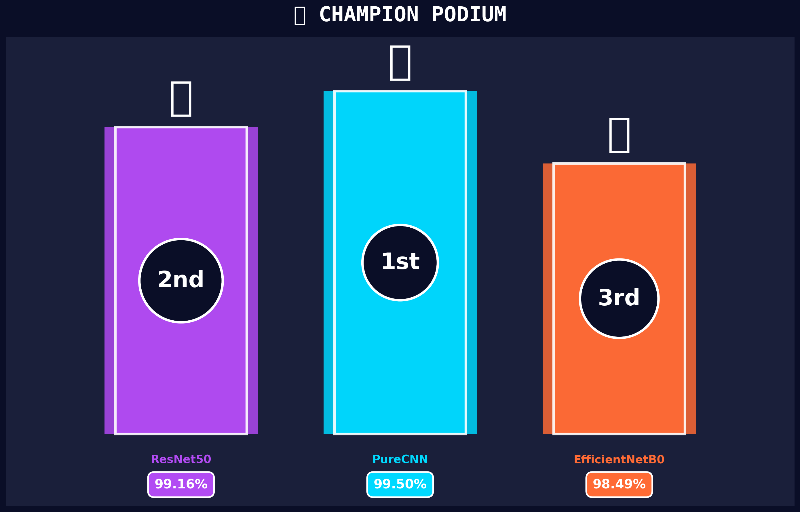
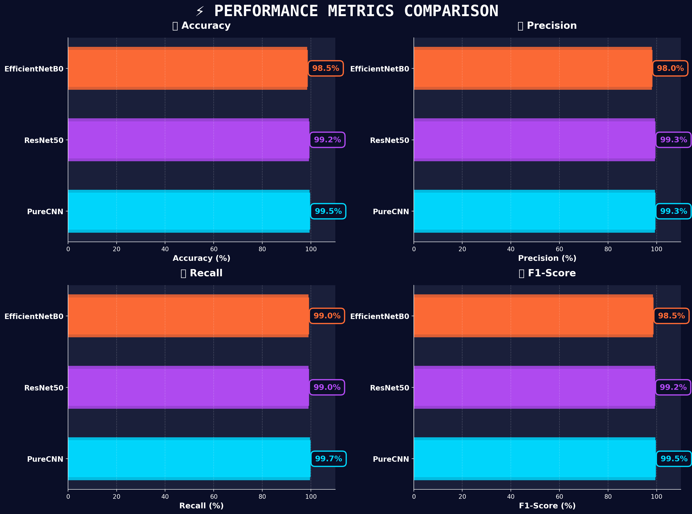
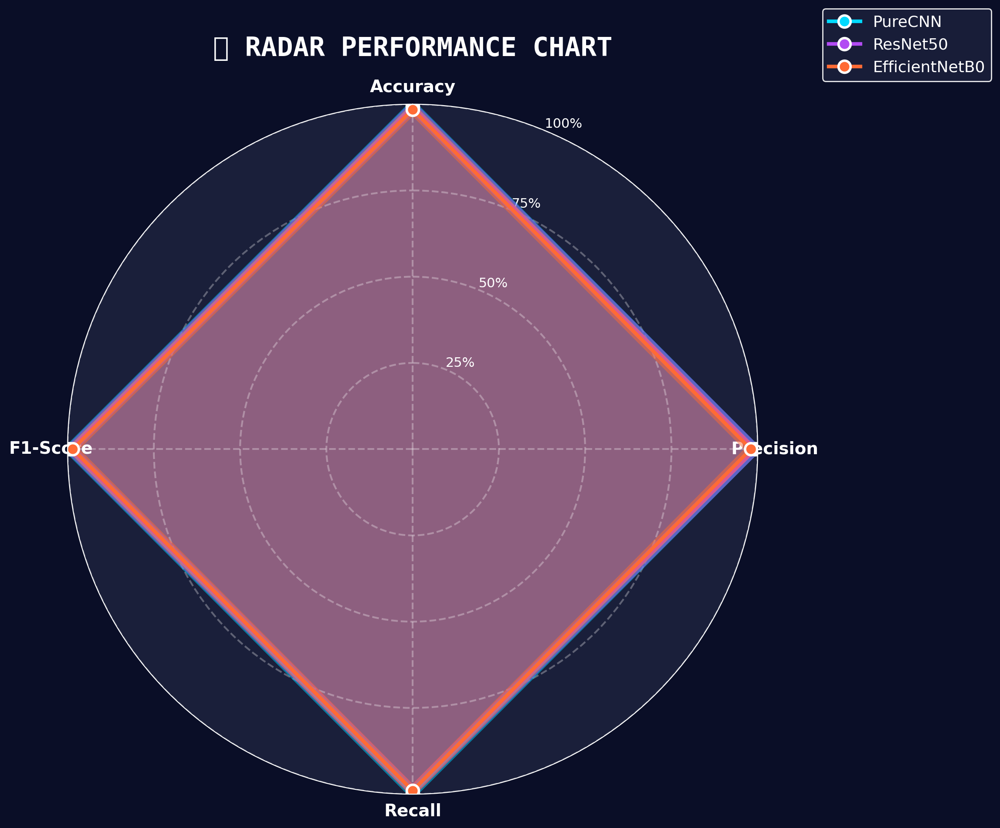

<div align="center">

# <span style="color:#1565C0; font-family: Roboto, sans-serif;">POTHOLE DETECTION AI SYSTEM</span>

**"Enhancing Road Safety through Advanced Deep Learning Computer Vision"**



<br><br>

<a href="https://your-deployment-link-here.com">
  
</a>
<a href="#">
  
</a>
<a href="#">
  
</a>

</div>

<br>

---

<h2 style="color:#1565C0; font-family: Roboto, sans-serif; font-weight: bold; border-bottom: 2px solid #1565C0; padding-bottom: 10px;">📋 EXECUTIVE SUMMARY</h2>

Kerusakan jalan, khususnya lubang (*potholes*), merupakan salah satu penyebab utama kecelakaan lalu lintas dan kerusakan kendaraan di seluruh dunia. Pendetection manual memakan waktu dan biaya tinggi.

Project ini menghadirkan solusi **Automated Pothole Detection System** berbasis *Computer Vision* yang mampu:
1.  **Mendeteksi keberadaan lubang** secara akurat ditiap frame gambar.
2.  **Memvisualisasikan area fokus model** menggunakan teknik *Explainable AI (Grad-CAM)* untuk transparansi keputusan.
3.  **Memberikan analisis komparatif** antara arsitektur CNN Custom (*PureCNN*) dengan State-of-the-Art Transfer Learning models (*ResNet50* & *EfficientNet*).

Sistem ini dirancang untuk dapat diintegrasikan pada *Dashcam* kendaraan atau Drone pemantau jalan raya untuk pelaporan otomatis real-time.

---

<h2 style="color:#1565C0; font-family: Roboto, sans-serif; font-weight: bold; border-bottom: 2px solid #1565C0; padding-bottom: 10px;">🧠 MODEL ARCHITECTURES & PERFORMANCE</h2>

Penelitian ini membandingkan tiga pendekatan arsitektur berbeda untuk menemukan keseimbangan terbaik antara akurasi, kecepatan, dan ukuran model. Pengujian dilakukan menggunakan dataset yang telah melalui proses *Image Augmentation* dan *Balancing*.

<table style="width:100%; text-align:center; font-family: Roboto, sans-serif; border-collapse: collapse;">
  <thead>
    <tr style="background-color:#1565C0; color:white;">
      <th style="padding: 12px; border: 1px solid #ddd;">RANK</th>
      <th style="padding: 12px; border: 1px solid #ddd;">MODEL ARCHITECTURE</th>
      <th style="padding: 12px; border: 1px solid #ddd;">ACCURACY</th>
      <th style="padding: 12px; border: 1px solid #ddd;">PRECISION</th>
      <th style="padding: 12px; border: 1px solid #ddd;">RECALL</th>
      <th style="padding: 12px; border: 1px solid #ddd;">CHARACTERISTICS</th>
    </tr>
  </thead>
  <tbody>
    <tr style="background-color:#E3F2FD; color:black; font-weight:bold;">
      <td style="padding: 10px; border: 1px solid #ddd;">🥇 1st</td>
      <td style="padding: 10px; border: 1px solid #ddd;">PureCNN (Custom)</td>
      <td style="padding: 10px; border: 1px solid #ddd; color: #1565C0;">99.49%</td>
      <td style="padding: 10px; border: 1px solid #ddd;">99.33%</td>
      <td style="padding: 10px; border: 1px solid #ddd;">99.66%</td>
      <td style="padding: 10px; border: 1px solid #ddd; text-align: left; font-size: 0.9em;">
        • Lightweight Architecture<br>• High Efficiency<br>• Optimized for Specific Task
      </td>
    </tr>
    <tr>
      <td style="padding: 10px; border: 1px solid #ddd;">🥈 2nd</td>
      <td style="padding: 10px; border: 1px solid #ddd;">ResNet50</td>
      <td style="padding: 10px; border: 1px solid #ddd; color: #1565C0;">99.16%</td>
      <td style="padding: 10px; border: 1px solid #ddd;">99.32%</td>
      <td style="padding: 10px; border: 1px solid #ddd;">98.99%</td>
      <td style="padding: 10px; border: 1px solid #ddd; text-align: left; font-size: 0.9em;">
        • Deep Residual Learning<br>• Robust Feature Extraction<br>• Higher Computational Cost
      </td>
    </tr>
    <tr style="background-color:#FAFAFA;">
      <td style="padding: 10px; border: 1px solid #ddd;">🥉 3rd</td>
      <td style="padding: 10px; border: 1px solid #ddd;">EfficientNetB0</td>
      <td style="padding: 10px; border: 1px solid #ddd; color: #1565C0;">98.48%</td>
      <td style="padding: 10px; border: 1px solid #ddd;">98.00%</td>
      <td style="padding: 10px; border: 1px solid #ddd;">98.99%</td>
      <td style="padding: 10px; border: 1px solid #ddd; text-align: left; font-size: 0.9em;">
        • Edge-Device Ready<br>• Fastest Training Time<br>• Smallest Model Size
      </td>
    </tr>
  </tbody>
</table>

<br>

<h3 style="color:#1565C0; font-family: Roboto, sans-serif; font-weight: bold;">📊 VISUAL ANALYSIS</h3>

<div align="center">
  
  
</div>

<br>

**Key Findings:**
1.  **PureCNN Dominance**: Meskipun memiliki arsitektur yang lebih sederhana dibandingkan ResNet50, PureCNN menunjukkan performa *Champion* dengan akurasi **99.49%**. Hal ini membuktikan bahwa untuk *specific domain task* (seperti deteksi lubang), arsitektur custom yang teroptimasi seringkali mengungguli model raksasa (*General Purpose Models*).
2.  **Efisiensi vs Akurasi**: EfficientNetB0 menjadi juara dalam hal kecepatan dan ukuran file, menjadikannya kandidat terbaik untuk deployment di perangkat *Internet of Things (IoT)* atau *Mobile Apps*, meskipun dengan sedikit pengorbanan akurasi (selisih ~1%).

---

<h2 style="color:#1565C0; font-family: Roboto, sans-serif; font-weight: bold; border-bottom: 2px solid #1565C0; padding-bottom: 10px;">📁 REPOSITORY STRUCTURE</h2>

Project ini diorganisir secara modular untuk memudahkan pengembangan dan deployment:

```bash
UAP_MACHINELEARNING/
│
├── 📂 allmodel/            # Centralized Assets & Comparison Data
│   ├── Comparison.csv      # Tabulasi hasil metrik semua model
│   ├── podium.png          # Visualisasi Juara Model
│   └── [Visualization Plots...]
│
├── 📂 Dashboard/           # 🚀 WEB APPLICATION CORE
│   ├── 📄 Dashboard.py     # Main Streamlit App (Sidebar & Landing Page)
│   ├── 📂 pages/           # Halaman Detil Per Model
│   │   ├── 2_PureCNN.py
│   │   ├── 3_ResNet50.py
│   │   └── 4_EfficientNet.py
│   ├── 📂 utils/           # Utility Scripts (Modular)
│   │   ├── inference.py    # Logika prediksi gambar
│   │   ├── gradcam.py      # Engine XAI (Explainable AI)
│   │   └── styling.py      # CSS & App Aesthetics
│   └── requirements.txt    # Dependency Library
│
├── 📂 PureCNN/             # [MODEL 1] Custom CNN Workspace
│   ├── code.ipynb          # Training Notebook
│   └── model.h5            # Saved Weights
│
├── 📂 ResNet50/            # [MODEL 2] Transfer Learning Workspace
│   └── [Notebooks & Models...]
│
└── 📂 EfficientNet/        # [MODEL 3] EfficientNet Workspace
    └── [Notebooks & Models...]
```

---

<h2 style="color:#1565C0; font-family: Roboto, sans-serif; font-weight: bold; border-bottom: 2px solid #1565C0; padding-bottom: 10px;">🚀 GETTING STARTED</h2>

Untuk menjalankan dashboard analisis ini di komputer lokal Anda:

1.  **Clone & Setup Environment**
    Pastikan Python 3.9+ terinstall.
    ```bash
    git clone https://github.com/username/UAP_MachineLearning.git
    cd UAP_MachineLearning
    pip install -r Dashboard/requirements.txt
    ```

2.  **Launch Dashboard**
    Jalankan perintah berikut pada terminal:
    ```bash
    cd Dashboard
    streamlit run Dashboard.py
    ```

3.  **Explore**
    Buka browser di alamat yang muncul (biasanya `http://localhost:8501`) untuk mengakses dashboard interaktif.

---

<div align="center" style="margin-top: 50px; padding: 20px; border-top: 1px solid #ddd;">
  <p style="font-size: 16px; color: #1565C0; font-weight: bold;">
    University of Muhammadiyah Malang
  </p>
  <p style="font-size: 14px; color: #666;">
    Machine Learning Final Project © 2024<br>
    Created with by <strong>Zeedan Mustami Argani</strong>
  </p>
  <br>
  
</div>
